<p align="center">
  <a href="https://mineboy2211.github.io/incr-os/"></a>
</p>

# INCR.OS

an incremental game where the whole thing is a terminal. you don't click stuff, you type commands.

**play it here: https://mineboy2211.github.io/incr-os/**

you start with a daemon that makes bytes. then you get threads that make daemons, forks that make threads, and it keeps going. at some point you reboot the whole machine for kernels, then you format it for cores, and then... you'll see.

## how to play

there's a tutorial when you start, but basically:

```
/help             shows the commands you have
/daemon           look at your first process
/buy daemon max   buy as many as you can
```

you unlock more commands as you go, so check `/help` once in a while. Tab autocompletes, up arrow gives you your last command, and you can chain stuff with `;` like `/buy daemon max; clock max`.

there's also files to read (`/ls`, `/cat`), random events you have to react to, challenges, scripts, and some other stuff i'm not gonna spoil. go poke around.

## saves

it saves by itself every few seconds in your browser and keeps going while you're away (up to 12h). if you want to move your save to another device use `/sys export` and `/sys import`.

works on pc, tablets and phones.

## running it locally

no build or anything, just download the files and open `index.html`.

---

if you find a bug or have an idea, open an issue :)
